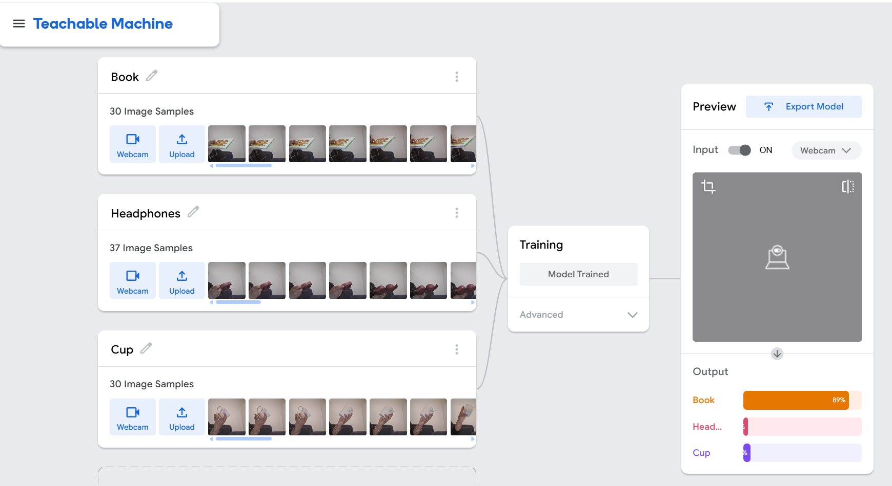

# Unsupervised Learning

An interactive image classification project powered by **Google's Teachable Machine**. This model classifies real-time video input into three categories: **Book**, **Headphones**, and **Cup**.

> [!NOTE]
> While Teachable Machine uses **Supervised Learning** under the hood (since classes are defined and trained with explicit labels), this repository serves as a practical demonstration and is cataloged under the course module **Unsupervised Learning / AI in Practice**.

## 🔗 Model Link
Access and test the live trained model directly in your browser:
👉 **[Live Teachable Machine Model](https://teachablemachine.withgoogle.com/models/g6g045LiU/)**

---

## 📸 Teachable Machine Setup & Model Training Interface

Below is the complete configuration and interface of the Teachable Machine setup, demonstrating the defined classes, trained model status, and live output prediction:

<p align="center">
  
</p>

### Key Interface Highlights:
* **Classes Configured**: 
  * **Book** (30 image samples captured)
  * **Headphones** (37 image samples captured)
  * **Cup** (30 image samples captured)
* **Training block**: Shows that the model has successfully completed training.
* **Preview & Prediction**: Shows real-time webcam validation and output confidence score bar chart (e.g., predicting **Book** with **89%** confidence).

---

## 🛠️ How to run locally or integrate
The model can be easily integrated into any web application. Below is a quick starter code snippet to run this model using Tensorflow.js:

```html
<div>Teachable Machine Image Model</div>
<button type="button" onclick="init()">Start</button>
<div id="webcam-container"></div>
<div id="label-container"></div>

<script src="https://cdn.jsdelivr.net/npm/@tensorflow/tfjs@latest/dist/tf.min.js"></script>
<script src="https://cdn.jsdelivr.net/npm/@teachablemachine/image@latest/dist/teachablemachine-image.min.js"></script>
<script type="text/javascript">
    // More API functions here:
    // https://github.com/googlecreativelab/teachablemachine-community/tree/master/libraries/image

    // the link to your model provided by Teachable Machine export panel
    const URL = "https://teachablemachine.withgoogle.com/models/g6g045LiU/";

    let model, webcam, labelContainer, maxPredictions;

    // Load the image model and setup the webcam
    async function init() {
        const modelURL = URL + "model.json";
        const metadataURL = URL + "metadata.json";

        // load the model and metadata
        model = await tmImage.load(modelURL, metadataURL);
        maxPredictions = model.getTotalClasses();

        // Convenience function to setup a webcam
        const flip = true; // whether to flip the webcam
        webcam = new tmImage.Webcam(200, 200, flip); // width, height, flip
        await webcam.setup(); // request access to the webcam
        await webcam.play();
        window.requestAnimationFrame(loop);

        // append elements to the DOM
        document.getElementById("webcam-container").appendChild(webcam.canvas);
        labelContainer = document.getElementById("label-container");
        for (let i = 0; i < maxPredictions; i++) { // and class labels
            labelContainer.appendChild(document.createElement("div"));
        }
    }

    async function loop() {
        webcam.update(); // update the webcam frame
        await predict();
        window.requestAnimationFrame(loop);
    }

    // run the webcam image through the image model
    async function predict() {
        // predict can take in an image, video or canvas html element
        const prediction = await model.predict(webcam.canvas);
        for (let i = 0; i < maxPredictions; i++) {
            const classPrediction =
                prediction[i].className + ": " + prediction[i].probability.toFixed(2);
            labelContainer.childNodes[i].innerHTML = classPrediction;
        }
    }
</script>
```

## 📚 About the Course
This repository is part of the **AI in Practice** curriculum at **XAMK** (South-Eastern Finland University of Applied Sciences).
