# Unsupervised Learning

An interactive image classification project powered by **Google's Teachable Machine**. This model classifies real-time video input into three categories: **Books**, **Headphones**, and **Cups**. 

> [!NOTE]
> While Teachable Machine uses **Supervised Learning** under the hood (since classes are defined and trained with explicit labels), this repository serves as a practical demonstration and is cataloged under the course module **Unsupervised Learning / AI in Practice**.

## 🔗 Model Link
Access and test the live trained model directly in your browser:
👉 **[Live Teachable Machine Model](https://teachablemachine.withgoogle.com/models/g6g045LiU/)**

---

## 📸 Project Screenshots & Training Process

Here is the step-by-step workflow of training, testing, and exporting the image classifier:

### 1. Data Collection & Class Definition
We defined three distinct classes for classification and captured image samples using the webcam.

<table border="0">
  <tr>
    <td width="33.3%" align="center">
      <b>Class 1: Book</b><br>
      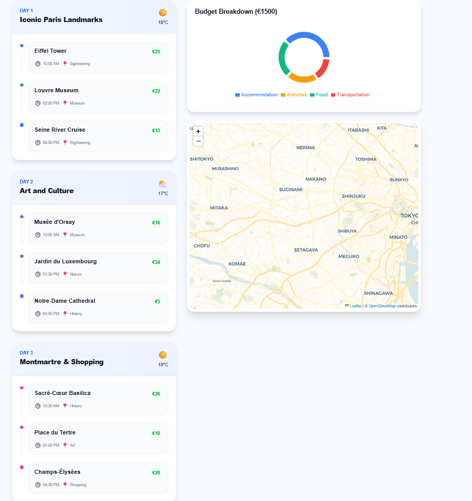
    </td>
    <td width="33.3%" align="center">
      <b>Class 2: Headphones</b><br>
      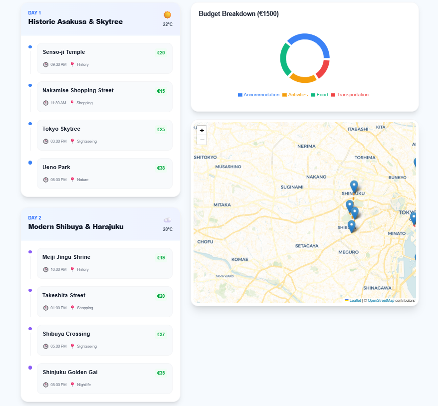
    </td>
    <td width="33.3%" align="center">
      <b>Class 3: Cup</b><br>
      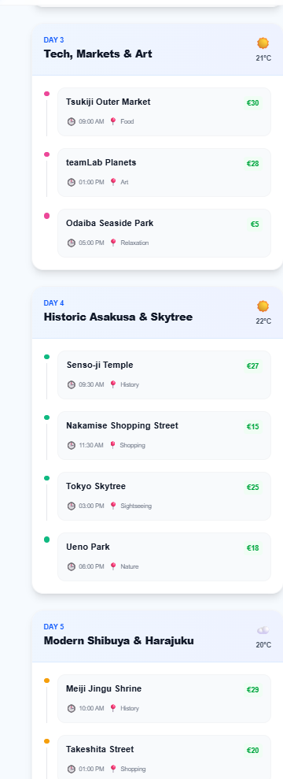
    </td>
  </tr>
</table>

---

### 2. Model Training & Parameter Setup
Configuring training epochs, batch size, and learning rate, then running the training process in the browser.

<table border="0">
  <tr>
    <td width="50%" align="center">
      <b>Training Progress</b><br>
      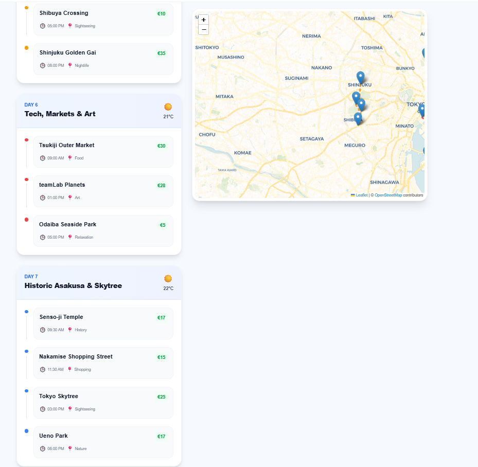
    </td>
    <td width="50%" align="center">
      <b>Advanced Training Metrics</b><br>
      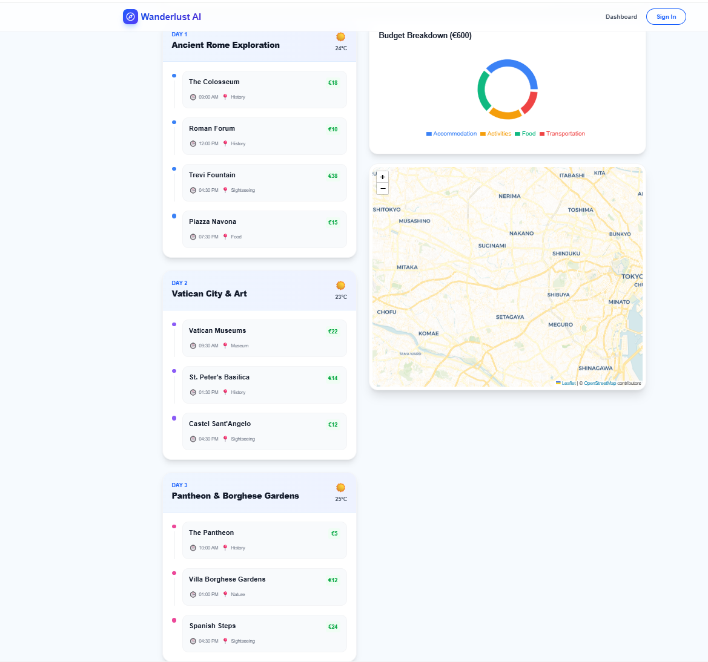
    </td>
  </tr>
  <tr>
    <td width="50%" align="center">
      <b>Epochs & Loss Graphs</b><br>
      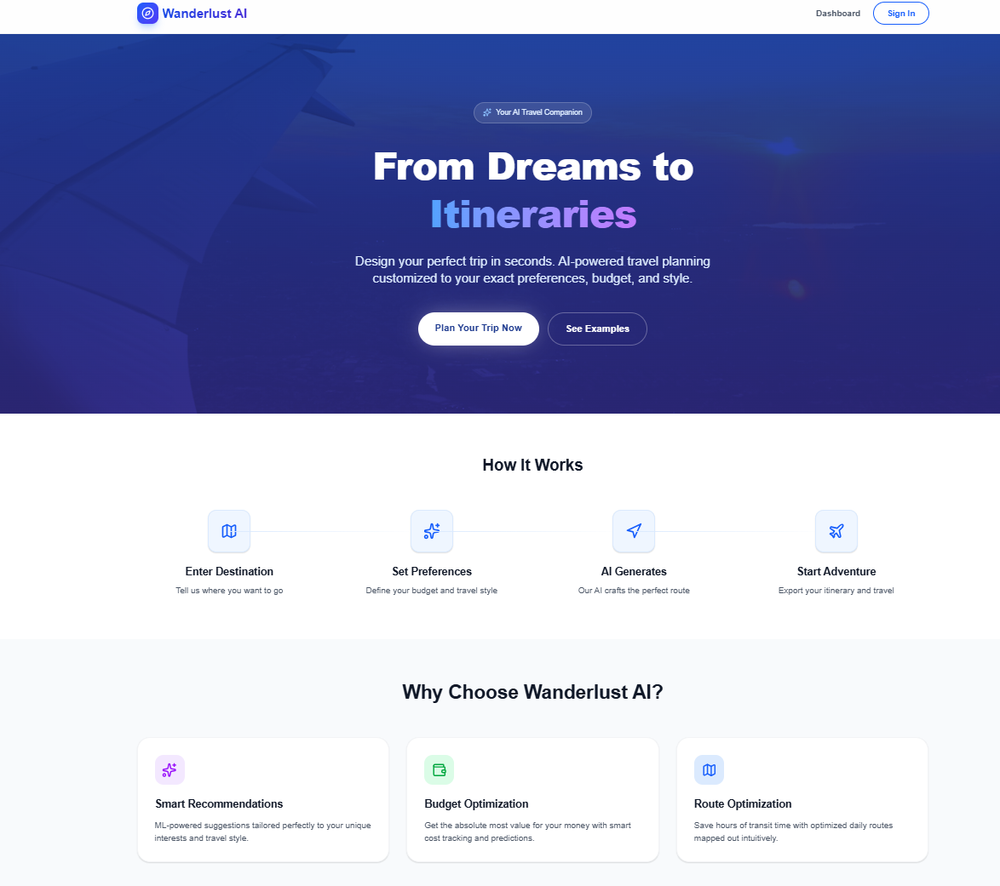
    </td>
    <td width="50%" align="center">
      <b>Accuracy Graph</b><br>
      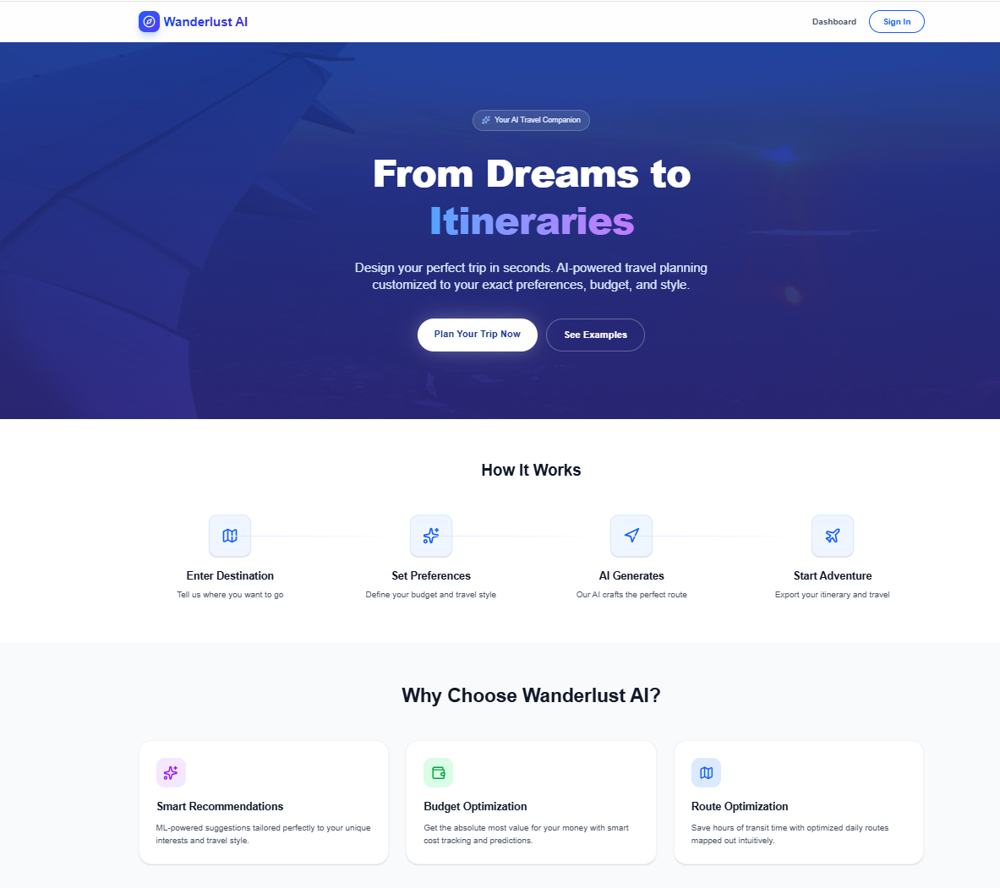
    </td>
  </tr>
</table>

---

### 3. Model Inference & Real-time Predictions
The model in action, predicting web-camera inputs with confidence scores.

<table border="0">
  <tr>
    <td width="33.3%" align="center">
      <b>Detecting Book (100%)</b><br>
      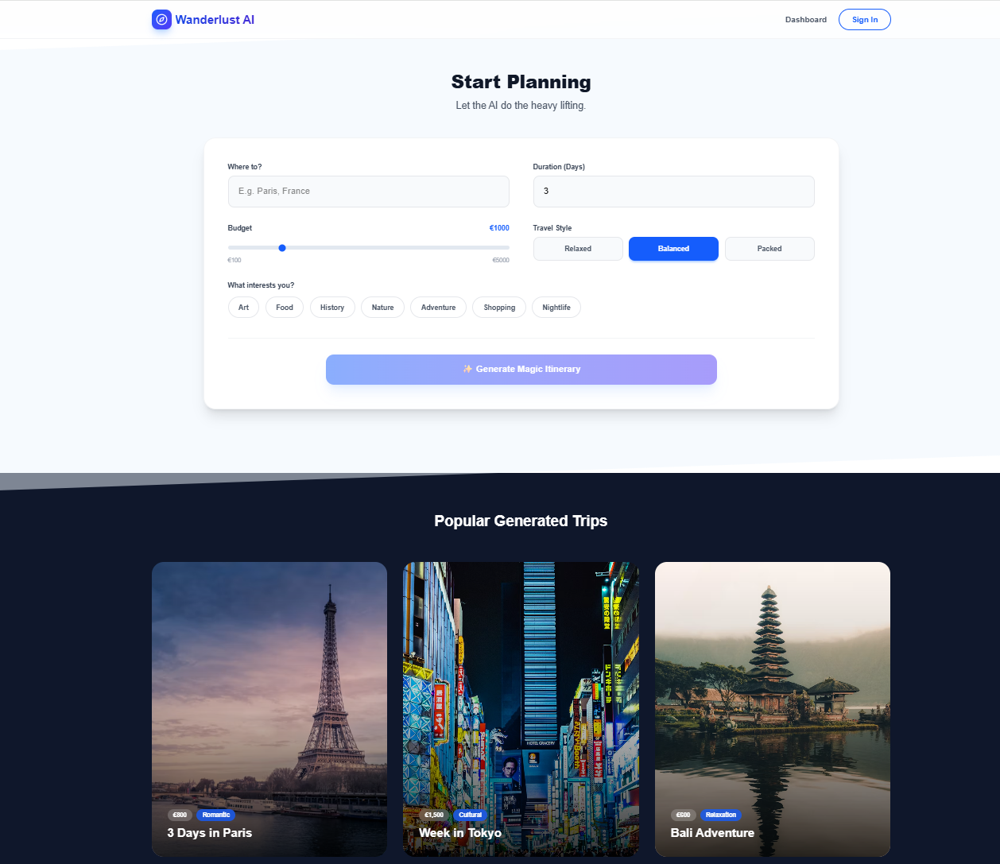
    </td>
    <td width="33.3%" align="center">
      <b>Detecting Headphones (100%)</b><br>
      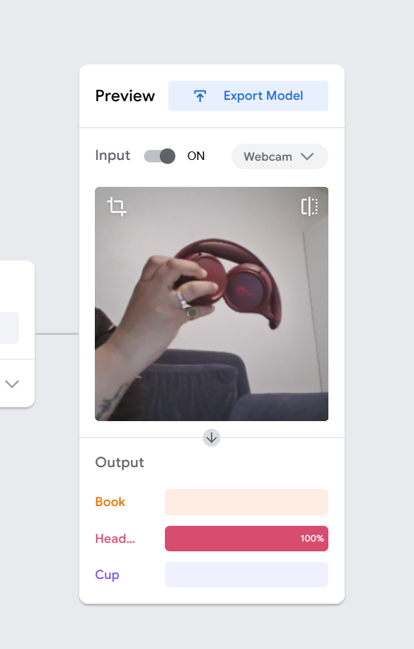
    </td>
    <td width="33.3%" align="center">
      <b>Detecting Cup (100%)</b><br>
      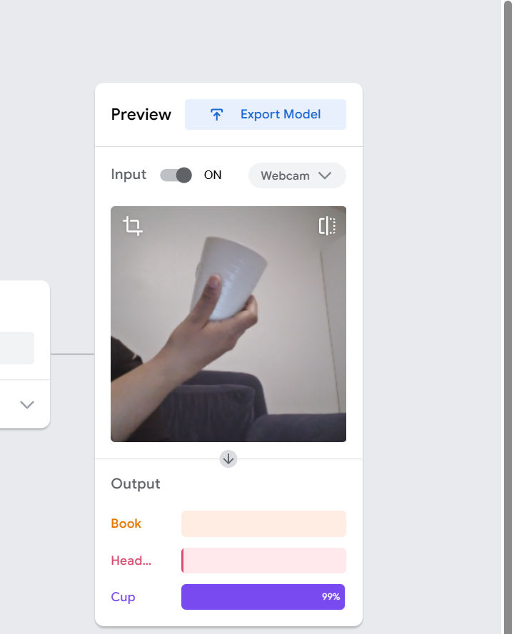
    </td>
  </tr>
  <tr>
    <td width="33.3%" align="center">
      <b>Webcam Active Preview</b><br>
      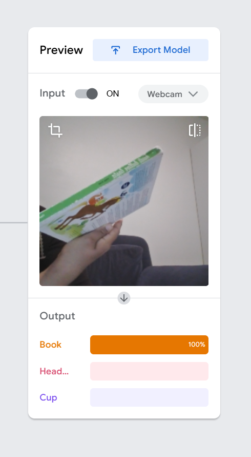
    </td>
    <td width="33.3%" align="center">
      <b>Confidence Score Output</b><br>
      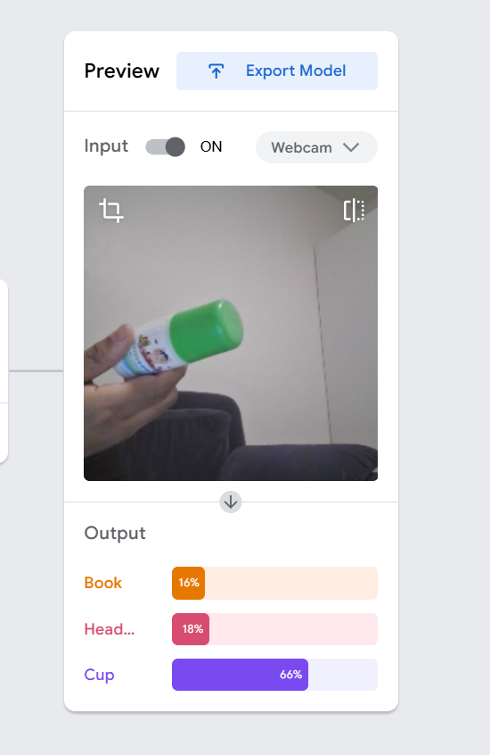
    </td>
    <td width="33.3%" align="center">
      <!-- Empty placeholder for alignment -->
    </td>
  </tr>
</table>

---

## 🛠️ How to run locally or integrate
The model can be easily integrated into any web application. Below is a quick starter code snippet to run this model using Tensorflow.js:

```html
<div>Teachable Machine Image Model</div>
<button type="button" onclick="init()">Start</button>
<div id="webcam-container"></div>
<div id="label-container"></div>

<script src="https://cdn.jsdelivr.net/npm/@tensorflow/tfjs@latest/dist/tf.min.js"></script>
<script src="https://cdn.jsdelivr.net/npm/@teachablemachine/image@latest/dist/teachablemachine-image.min.js"></script>
<script type="text/javascript">
    // More API functions here:
    // https://github.com/googlecreativelab/teachablemachine-community/tree/master/libraries/image

    // the link to your model provided by Teachable Machine export panel
    const URL = "https://teachablemachine.withgoogle.com/models/g6g045LiU/";

    let model, webcam, labelContainer, maxPredictions;

    // Load the image model and setup the webcam
    async function init() {
        const modelURL = URL + "model.json";
        const metadataURL = URL + "metadata.json";

        // load the model and metadata
        model = await tmImage.load(modelURL, metadataURL);
        maxPredictions = model.getTotalClasses();

        // Convenience function to setup a webcam
        const flip = true; // whether to flip the webcam
        webcam = new tmImage.Webcam(200, 200, flip); // width, height, flip
        await webcam.setup(); // request access to the webcam
        await webcam.play();
        window.requestAnimationFrame(loop);

        // append elements to the DOM
        document.getElementById("webcam-container").appendChild(webcam.canvas);
        labelContainer = document.getElementById("label-container");
        for (let i = 0; i < maxPredictions; i++) { // and class labels
            labelContainer.appendChild(document.createElement("div"));
        }
    }

    async function loop() {
        webcam.update(); // update the webcam frame
        await predict();
        window.requestAnimationFrame(loop);
    }

    // run the webcam image through the image model
    async function predict() {
        // predict can take in an image, video or canvas html element
        const prediction = await model.predict(webcam.canvas);
        for (let i = 0; i < maxPredictions; i++) {
            const classPrediction =
                prediction[i].className + ": " + prediction[i].probability.toFixed(2);
            labelContainer.childNodes[i].innerHTML = classPrediction;
        }
    }
</script>
```

## 📚 About the Course
This repository is part of the **AI in Practice** curriculum at **XAMK** (South-Eastern Finland University of Applied Sciences).
